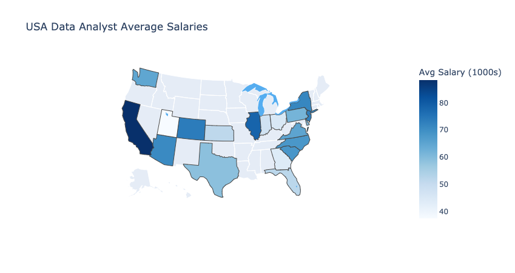

# USA Data Analyst Job Market Analysis

  

## Table of Contents

* [General Information](#general-information)
    * [Data](#data)
    * [EDA](#eda)
    * [Model](#model)
* [Technologies](#technologies)
    * [Python](#python)
    * [Visualization](#visualization)
* [Conclusion](#conclusion)
* [Future Improvements](#future-improvements)

## General Inforamtion
Data Analysts are currently among the most sought-after professionals.  Though that title seems simple and descriptive, job responsibilities can be quite diverse.  From some job descriptions asking for minor qualifications to others appearing more of a data scientist role.  As a way to begin to analyse how the industry values and describes the data analyst position, I have taken a data set from kaggle.com and applied multiple EDA methods to begin to unravel what this title means and how its valued by different industries.   